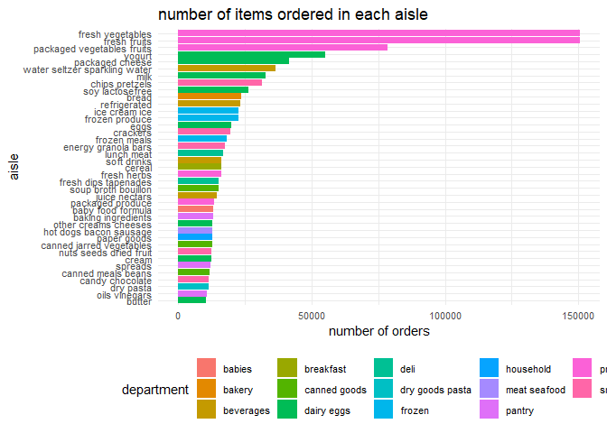
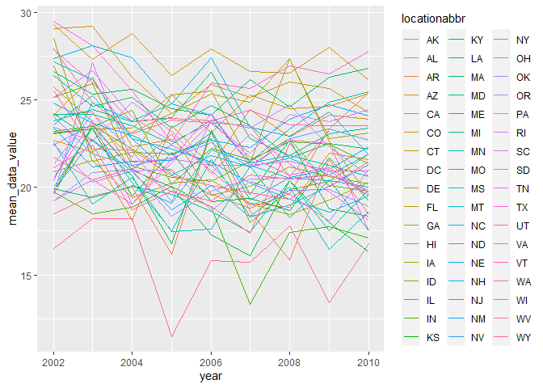
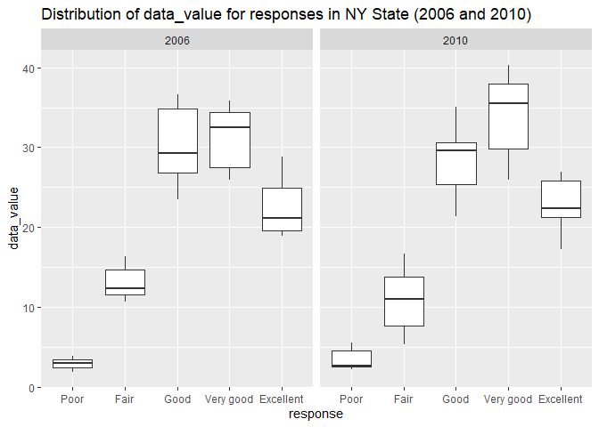
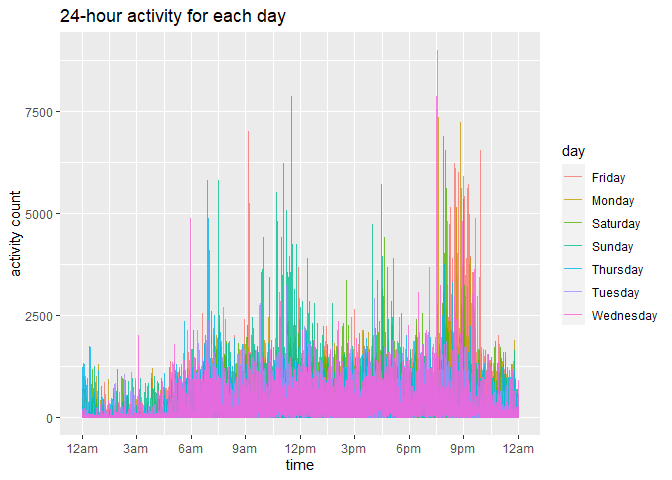

Homework 3
================
Yimiao Pang

``` r
library(p8105.datasets)
library(tidyverse)
library(dplyr)
library(ggplot2)
library(patchwork)
```

## Problem 1

``` r
# load data

data("instacart")

num_row = nrow(instacart)

# number of aisles & most ordered from

num_aisles = nlevels(factor(instacart$aisle))
sum_aisles = as.data.frame(table(factor(instacart$aisle)))
most_aisle = sum_aisles[which.max(sum_aisles$Freq), "Var1"]
```

In the instacard dataset, there are 1384617 rows and 15 columns which
include order\_id, product\_id, add\_to\_cart\_order, reordered,
user\_id, eval\_set, order\_number, order\_dow, order\_hour\_of\_day,
days\_since\_prior\_order, product\_name, aisle\_id, department\_id,
aisle, and department.

There are 134 different aisles. The aisle most ordered from is fresh
vegetables aisle.

``` r
# plot - number of items

instacart %>% 
  group_by(aisle, department) %>% 
  summarize(n_freq = n()) %>% 
  filter(n_freq > 10000) %>% 
  ggplot(aes(x = reorder(aisle, n_freq), y = n_freq, fill = department)) + geom_col() +
  labs(
    title = "number of items ordered in each aisle",
    x = "aisle",
    y = "number of orders"
  ) + 
  theme_minimal() +
  theme(axis.text.y = element_text(hjust = 1),
        axis.text = element_text(size = 8),
        legend.text = element_text(size = 8),
        legend.position = "bottom") + 
  coord_flip()
```

<!-- -->

The x-axis represents the number of orders and the y-axis lists all the
aisles whose orders were over 10000. There are 39 aisles from which over
10000 items were ordered. And we can see that the fresh vegetables is
the aisle most frequently ordered from.

``` r
# 3 most popular items
## baking ingredients
b_df = filter(instacart, aisle == "baking ingredients")
b_sum = as.data.frame(table(factor(b_df$product_name)))
b_3 = top_n(b_sum, 3, Freq)
b_tb = tibble(
  b_3[1],
  b_3[2]
) %>% 
  janitor::clean_names() %>% 
  rename(product_name = var1) %>% 
  mutate(aisle = "baking ingredients")

## dog food care
d_df = filter(instacart, aisle == "dog food care")
d_sum = as.data.frame(table(factor(d_df$product_name)))
d_3 = top_n(d_sum, 3, Freq)
d_tb = tibble(
  d_3[1],
  d_3[2]
) %>% 
  janitor::clean_names() %>% 
  rename(product_name = var1) %>% 
  mutate(aisle = "dog food care")

## packaged vegetables fruits
p_df = filter(instacart, aisle == "packaged vegetables fruits")
p_sum = as.data.frame(table(factor(p_df$product_name)))
p_3 = top_n(p_sum, 3, Freq)
p_tb = tibble(
  p_3[1],
  p_3[2]
) %>% 
  janitor::clean_names() %>% 
  rename(product_name = var1) %>% 
  mutate(aisle = "packaged vegetables fruits")

## combine

tb = rbind(b_tb, d_tb, p_tb) %>% 
  arrange(aisle, desc(freq))
tb = tb[c("aisle", "product_name", "freq")]
tb
## # A tibble: 9 x 3
##   aisle                      product_name                                   freq
##   <chr>                      <fct>                                         <int>
## 1 baking ingredients         Light Brown Sugar                               499
## 2 baking ingredients         Pure Baking Soda                                387
## 3 baking ingredients         Cane Sugar                                      336
## 4 dog food care              Snack Sticks Chicken & Rice Recipe Dog Treats    30
## 5 dog food care              Organix Chicken & Brown Rice Recipe              28
## 6 dog food care              Small Dog Biscuits                               26
## 7 packaged vegetables fruits Organic Baby Spinach                           9784
## 8 packaged vegetables fruits Organic Raspberries                            5546
## 9 packaged vegetables fruits Organic Blueberries                            4966
```

``` r
app_ice_df = filter(instacart, product_name == "Pink Lady Apples" | product_name == "Coffee Ice Cream") %>% 
  select(product_name, order_dow, order_hour_of_day) %>% 
  pivot_wider(
    names_from = order_dow,
    values_from = order_hour_of_day,
    values_fn = list(order_hour_of_day = mean)
  )
 app_ice_df = app_ice_df[c("product_name", "0", "1", "2", "3", "4", "5", "6")] %>% 
  rename("Sunday" = "0",
         "Monday" = "1",
         "Tuesday" = "2",
         "Wednesday" = "3",
         "Thursday" = "4",
         "Friday" = "5",
         "Saturday" = "6")
app_ice_df
## # A tibble: 2 x 8
##   product_name     Sunday Monday Tuesday Wednesday Thursday Friday Saturday
##   <chr>             <dbl>  <dbl>   <dbl>     <dbl>    <dbl>  <dbl>    <dbl>
## 1 Pink Lady Apples   13.4   11.4    11.7      14.2     11.6   12.8     11.9
## 2 Coffee Ice Cream   13.8   14.3    15.4      15.3     15.2   12.3     13.8
```

## Problem 2

``` r
# load data
data("brfss_smart2010")

# data cleaning
df2 = brfss_smart2010 %>% 
  janitor::clean_names() %>% 
  filter(topic == "Overall Health") %>% 
  mutate(response_rank = recode(response, 'Poor' = 0, 'Fair' = 1, 'Good' = 2, 'Very good' = 3, 'Excellent' = 4)) %>% 
  arrange(response_rank) %>% 
  select(-response_rank)
```

``` r
# 2002 --- >=7
df2002 = filter(df2, year == 2002) %>% 
  select(locationabbr, locationdesc)

levels2002 = levels(factor(df2002$locationabbr))

i = 1
n = 0
states2002 = c()
while (i <= length(levels2002)) {
  state_df = df2002 %>% 
    filter(locationabbr == levels2002[i])
  if (nlevels(factor(state_df$locationdesc)) >= 7) {
    n = n + 1
    states2002[n] = levels2002[i]
  }
  i = i + 1
}

# 2010 --- >=7
df2010 = filter(df2, year == 2010) %>%
  select(locationabbr, locationdesc)

levels2010 = levels(factor(df2010$locationabbr))

i = 1
n = 0
states2010 = c()
while (i <= length(levels2010)) {
  state_df = df2010 %>%
    filter(locationabbr == levels2010[i])
  if (nlevels(factor(state_df$locationdesc)) >= 7) {
    n = n + 1
    states2010[n] = levels2010[i]
  }
  i = i + 1
}

states2002
## [1] "CT" "FL" "MA" "NC" "NJ" "PA"
states2010
##  [1] "CA" "CO" "FL" "MA" "MD" "NC" "NE" "NJ" "NY" "OH" "PA" "SC" "TX" "WA"
```

In 2002, there are 6 states observed at 7 or more locations. They are
CT, FL, MA, NC, NJ, PA.

In 2010, there are 14 states observed at 7 or more locations. They are
CA, CO, FL, MA, MD, NC, NE, NJ, NY, OH, PA, SC, TX, WA.

``` r
# extract data
ex_df = filter(df2, response == "Excellent") %>% 
  select(year, locationabbr, data_value)


# calculate averages & aggregate data frame
ex_ag_df = ex_df %>% 
  group_by(locationabbr, year) %>% 
  summarize(mean_data_value = mean(data_value, na.rm = TRUE))

# spaghetti plot
ggplot(ex_ag_df, aes(x = year, y = mean_data_value, color = locationabbr)) + 
  geom_line() + 
  theme(legend.position = "right")
```

<!-- -->

``` r
  labs(title = "average values over time within states",
       y = "average value")
## $y
## [1] "average value"
## 
## $title
## [1] "average values over time within states"
## 
## attr(,"class")
## [1] "labels"
```

``` r
df2 %>% 
  group_by(year, locationabbr) %>% 
  filter((year == 2006 | year == 2010),
         locationabbr == "NY") %>% 
  ggplot(aes(x = response, y = data_value)) + 
  geom_boxplot() +
  labs(title = "Distribution of data_value for responses in NY State (2006 and 2010)") +
  facet_grid(. ~year)
```

<!-- -->

## Problem 3

``` r
accel_df = read_csv("./data/accel_data.csv") %>% 
  janitor::clean_names() %>% 
  mutate(weekday_vs_weekend = recode(day,
                                     "Saturday" = "weekend",
                                     "Sunday" = "weekend",
                                     "Monday" = "weekday",
                                     "Tuesday" = "weekday",
                                     "Wednesday" = "weekday", 
                                     "Thursday" = "weekday",
                                     "Friday" = "weekday")) %>% 
  select(week, day_id, day, weekday_vs_weekend, everything()) %>% 
  pivot_longer(
    activity_1:activity_1440,
    names_to = "minute",
    names_prefix = "activity_",
    values_to = "activity_count"
  ) %>% 
  mutate(minute = as.numeric(minute))

accel_df
## # A tibble: 50,400 x 6
##     week day_id day    weekday_vs_weekend minute activity_count
##    <dbl>  <dbl> <chr>  <chr>               <dbl>          <dbl>
##  1     1      1 Friday weekday                 1           88.4
##  2     1      1 Friday weekday                 2           82.2
##  3     1      1 Friday weekday                 3           64.4
##  4     1      1 Friday weekday                 4           70.0
##  5     1      1 Friday weekday                 5           75.0
##  6     1      1 Friday weekday                 6           66.3
##  7     1      1 Friday weekday                 7           53.8
##  8     1      1 Friday weekday                 8           47.8
##  9     1      1 Friday weekday                 9           55.5
## 10     1      1 Friday weekday                10           43.0
## # ... with 50,390 more rows
```

There are 50400 observations and 6 different variables included in the
dataframe. The variables include week, day\_id, day,
weekday\_vs\_weekend, minute and activity\_count.

``` r
accel_df %>% 
  group_by(week, day, day_id) %>%
  summarize(total = sum(activity_count)) %>% 
  knitr::kable()
```

| week | day       | day\_id |     total |
|-----:|:----------|--------:|----------:|
|    1 | Friday    |       1 | 480542.62 |
|    1 | Monday    |       2 |  78828.07 |
|    1 | Saturday  |       3 | 376254.00 |
|    1 | Sunday    |       4 | 631105.00 |
|    1 | Thursday  |       5 | 355923.64 |
|    1 | Tuesday   |       6 | 307094.24 |
|    1 | Wednesday |       7 | 340115.01 |
|    2 | Friday    |       8 | 568839.00 |
|    2 | Monday    |       9 | 295431.00 |
|    2 | Saturday  |      10 | 607175.00 |
|    2 | Sunday    |      11 | 422018.00 |
|    2 | Thursday  |      12 | 474048.00 |
|    2 | Tuesday   |      13 | 423245.00 |
|    2 | Wednesday |      14 | 440962.00 |
|    3 | Friday    |      15 | 467420.00 |
|    3 | Monday    |      16 | 685910.00 |
|    3 | Saturday  |      17 | 382928.00 |
|    3 | Sunday    |      18 | 467052.00 |
|    3 | Thursday  |      19 | 371230.00 |
|    3 | Tuesday   |      20 | 381507.00 |
|    3 | Wednesday |      21 | 468869.00 |
|    4 | Friday    |      22 | 154049.00 |
|    4 | Monday    |      23 | 409450.00 |
|    4 | Saturday  |      24 |   1440.00 |
|    4 | Sunday    |      25 | 260617.00 |
|    4 | Thursday  |      26 | 340291.00 |
|    4 | Tuesday   |      27 | 319568.00 |
|    4 | Wednesday |      28 | 434460.00 |
|    5 | Friday    |      29 | 620860.00 |
|    5 | Monday    |      30 | 389080.00 |
|    5 | Saturday  |      31 |   1440.00 |
|    5 | Sunday    |      32 | 138421.00 |
|    5 | Thursday  |      33 | 549658.00 |
|    5 | Tuesday   |      34 | 367824.00 |
|    5 | Wednesday |      35 | 445366.00 |

According the the table above, the total activity count is more likely
to increase from Monday to Friday and to decrease during the weekend.

``` r
accel_df %>% 
  ggplot(aes(x = minute, y = activity_count, color = day)) + 
  geom_line(alpha = 0.8) +
  labs(
    title = "24-hour activity for each day",
    x = "time",
    y = "activity count"
  ) +
  scale_x_continuous(breaks = c(0, 180, 360, 540, 720, 900, 1080, 1260, 1440),
                     labels = c("12am", "3am", "6am", "9am", "12pm", "3pm", "6pm", "9pm", "12am"),
                     limits = c(0, 1440))
```

<!-- -->

Within a day, the activity count is lower in the midnight, and higher
during the daytime and extremely high during 7pm-10pm. After 10pm, it
drops dramatically to a low level. There are 4 peaks in a day, one at
7am, one at 11am, one at 5pm and the last one is at 9pm.

Moreover, we can see that the activity count is higher at Friday between
8pm and 10pm than other days.
